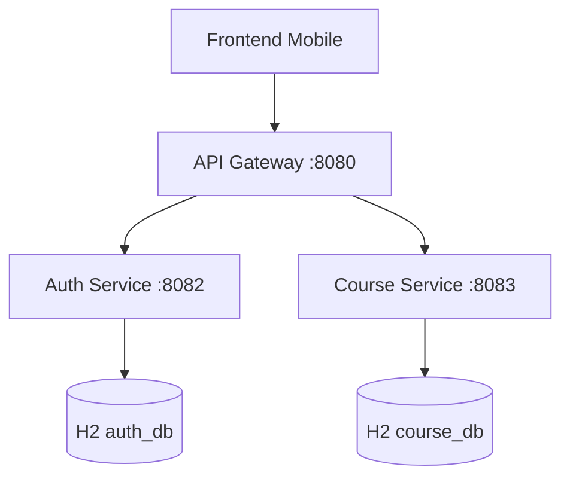

# Architecture - PathLearn

## Schéma

## Services

### Gateway (Port 8080)
- Point d'entrée unique
- Routage : `/auth/**` → Auth Service, `/courses/**` → Course Service
- Spring Cloud Gateway

### Auth Service (Port 8082)
- Authentification JWT
- Gestion utilisateurs et inscriptions
- Base H2 en mémoire

### Course Service (Port 8083)
- Catalogue de formations
- CRUD cours
- Base H2 en mémoire

## Technologies

- **Backend** : Spring Boot 4.0.2, Java 21
- **Build** : Gradle 8.14+
- **DB** : H2 (mode PostgreSQL)
- **Container** : Docker
- **CI/CD** : GitHub Actions

## Flux Authentification

1. Client → `POST /auth/register` → Création compte
2. Client → `POST /auth/login` → Récupération JWT
3. Client → `GET /courses` (avec JWT) → Liste formations

## Principes

- Architecture microservices
- Une base de données par service
- Communication via API REST
- Containerisation complète

## Sécurité

- JWT (expiration 24h)
- Rôles : USER, ADMIN
- Spring Security